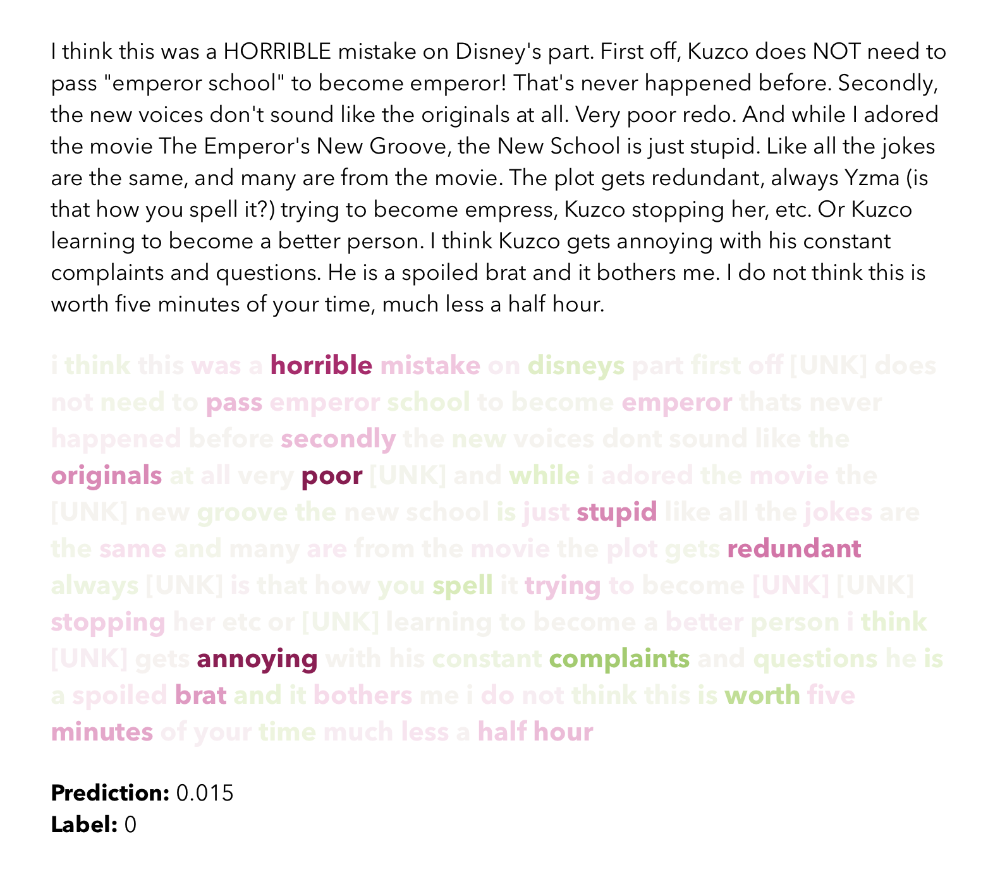

# tensorflow-sentiment-explainer

This project is an experiment in using [SHAP values](https://christophm.github.io/interpretable-ml-book/shap.html) to explain the role of individual words in a natural language model that predicts the sentiment of a document based on word sequences. The aim is to estimate the contribution of each individual word in a sequence to the predicted sentiment of the whole document.

There are two components to the project:

1. A recurrent neural network that has been trained to predict the sentiment of movie reviews in the [IMDB movie reviews](https://www.tensorflow.org/datasets/catalog/imdb_reviews) dataset.

2. Functions that "explain" the model's predictions by estimating SHAP values for each individual token in the input sequence. One of these function generates a dictionary of data that can be used to visualise the contribution of each individual token in the sequence to the prediction.

This project is a proof of concept and a work in progress.

## 1. Creating the environment

Create the environment with `venv`.

```zsh
/usr/local/bin/python3 -m venv env
source env/bin/activate
pip install --upgrade pip
pip install ipython numpy pandas scikit-learn matplotlib tensorflow tensorflow-datasets shap
```

Activate the environment with `source`.

```zsh
source env/bin/activate
```

Deactivate the environment

```zsh
deactivate
```

## 2. Reproducing the output

The `main` module contains three functions for producing (and reproducing) the results. Each function takes the name of a model to work with. The function for training a model will create and save a model with the given name, while the functions for evaluating a model and explaining the predictions from a model will look for a model with that name in the `models` directory and use that to make predictions for evaluation or explanation.

This repository contains a pre-trained model called `rnn_sentiment_classifer`, which can be used to evaluate or explain predictions from the training, validation and test sets. Note that if you train a new model with this model name it will overwrite the pre-trained model in the `models` directory.

### 2.1. Train a model

To train a new model, provide `train_model` with the name to use for the model. This will save the model, the vectorizer and tensorboard logs for this model using the model name.

```python
from sentiment import main
model, history, vectorizer = main.train_model('my_model')
```

### 2.2. Evaulate a model

To evaluate a model, provide `evaluate_model` with the name of a model and the name of the dataset to use for the evaluation, which should be either `val`, or `test`.

```python
from sentiment import main
results = main.evaluate_model('my_model', evaulation_set='test')
```

### 2.3. Explain a model

To get the explanatory data for a model, provide `explain_model` with the name of the model and the name of the dataset to use for the predictions to explain, which should be either `val`, or `test`. 

The SHAP explainer will use some of the values from the training set as background data. You can designate a slice of records to use as background data and a slice to use for predictions with the `background_start`, `background_end`, `evaluation_start`, and `evaluation_end` arguments. For example, to get explanatory data for predictions of the first ten records in the test set, using the first hundred records of the training set as backfreound data, you would do the following.

```python
from sentiment import main
reviews = main.explain_model(
    'my_model',
    evaluation_set='test', 
    evaluation_start=0, 
    evaluation_end=10,
    background_start=0, 
    background_end=100):
```

This function returns a dictionary of results data, which includes the original text of the review, the true sentiment label, the predicted sentiment label (as a probability between 0 and 1), the list of tokens from the vectorizer, and the list of SHAP scores for each token. This dictionary can be saved as json if you want to export the data for analysis and visualisation.

```python
import json
reviews_serialized = json.dumps(reviews)
with open('data/output/reviews-50.json', 'w') as outfile:
    outfile.write(reviews_serialized)
```

## 3. Metrics for the RNN sentiment classifier

The following table shows basic metrics for the `rnn_sentiment_classifier` model on the test set. This model has already been trained and can be found in the `models` directory.

| Metric    | Score  |
| --------- | ------ |
| Accuracy  | 0.895  |
| Precision | 0.893  |
| Recall    | 0.901  |
| F1 Score  | 0.897  |

## 4. Visualisation of the results

The following visualisation compares the original text of a movie review from the test set with a representation of how the sentiment classifier sees the review. Each token in the sequence is shaded with its SHAP value. Tokens shaded green contributed positive sentiment to the prediction, while tokens shaded pink contributed negative sentiment to the prediction. The strength of the shading incicates the relative strength of the contribution.


